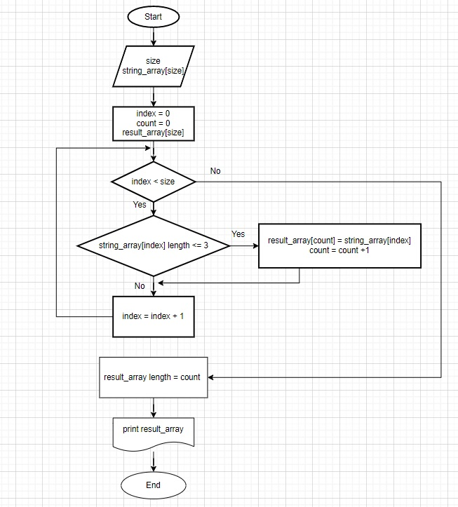

## Задача
Написать программу, которая из имеющегося массива строк формирует массив из строк, длина которых меньше либо равна 3 символа.
Первоначальный массив можно ввести с клавиатуры, либо задать на старте выполнения алгоритма.
При решении не рекомендуется пользоваться коллекциями, лучше обойтись исключительно массивами.
## Решение

Программа запрашивает у пользователя размер и элементы исходного массива строк, затем поочередно проверяет все элементы заданного пользователем массива и, если количество символов в строке элемента меньше или равно 3, записывает этот элемент в новый массив, изначально соответствующий размером заданному массиву. Также программа запоминает количество таких элементов и после прохождения всего заданного массива изменяет размер нового массива в соответствии с количеством найденных и презаписанных элементов.
После этого программа выводит вновь созданный массив на экран.  

